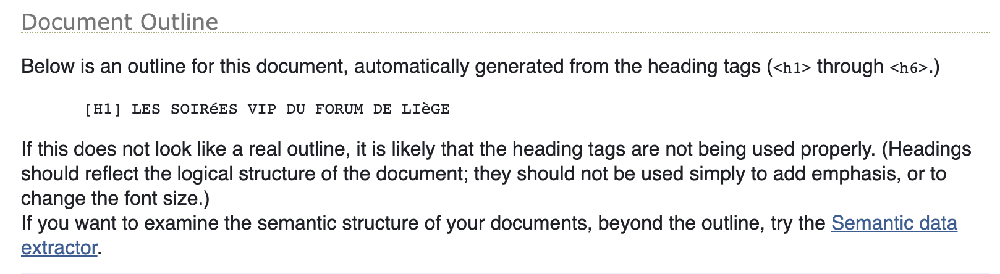
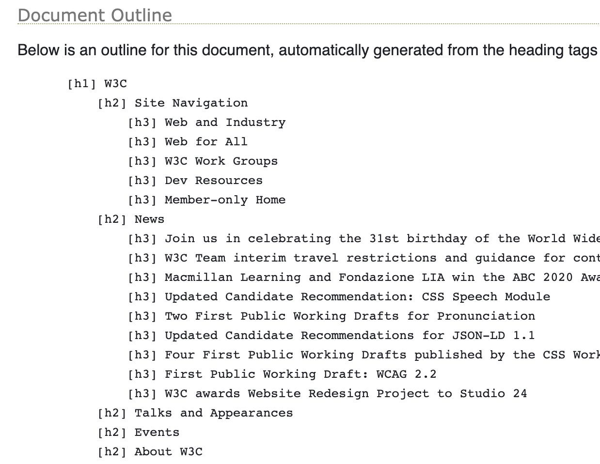
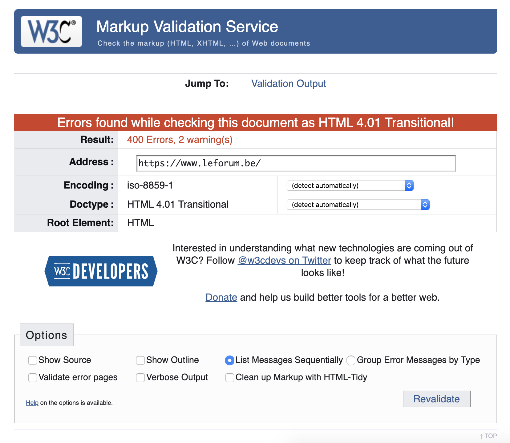
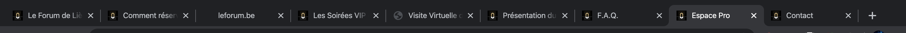
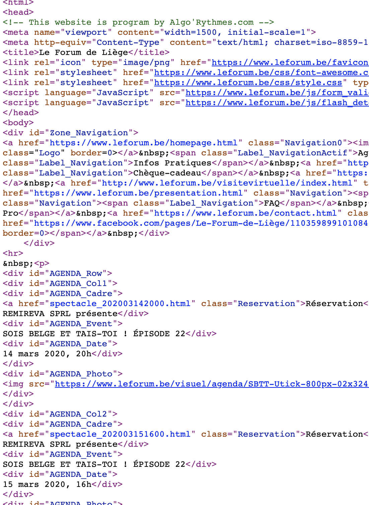
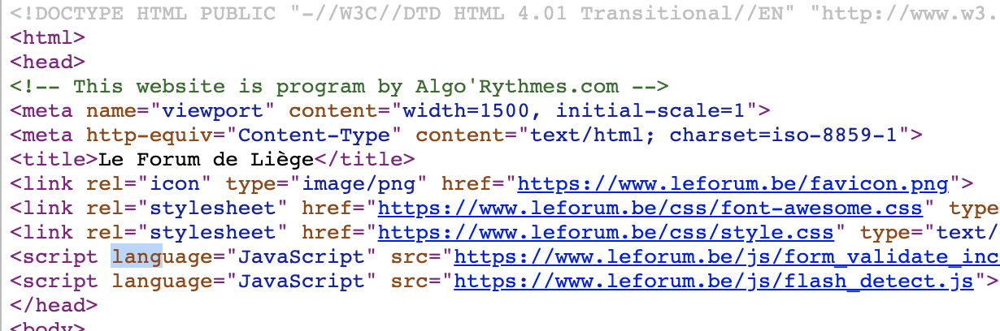
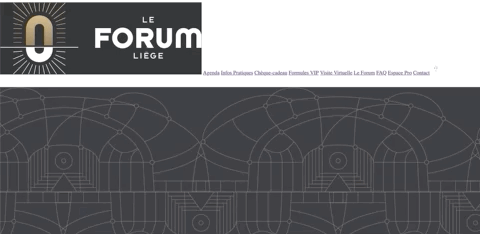
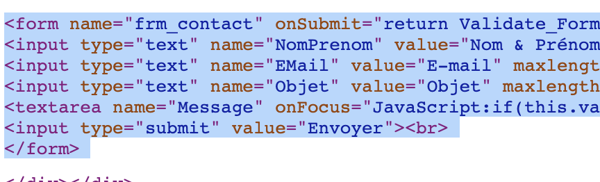
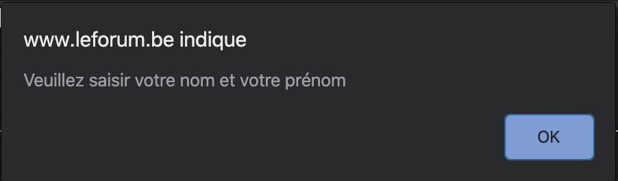

# LES DIRECTIVES D'ANYSURFER TESTÉES SUR LE SITE DU FORUM DE LIÈGE
> [Retourner à la racine du repo Le Forum](../../..) \
> Liens : [Les directives d'AnySurfer](https://www.anysurfer.be/fr/en-pratique/directives) & [Le Forum de Liège](https://www.leforum.be/)

## Navigation
### 1.1 La totalité du site est utilisable au moyen du clavier `NON`

Certaines balises sont visibles quand on navigue au clavier (c-à-d avec le TAB) telles que le menu principal.
Mais les liens et les boutons ne sont absolument pas visible sauf si on regarde le lien en bas à gauche de l'écran qui montre le href du lien sur lequel on se trouve). 

Voici un aperçu de ce que l'on voit lorsqu'on TAB :

### 1.2 Les intitulés des liens sont significatifs dans leur contexte `NON`

Les liens (et boutons) ne nous indiquent absolument pas à quoi font référence les liens cliquables.

"réservation" de quoi exactement ?
                    

### 2.1 Le code source est conforme à la spécification du langage `NON`

Voici l'outline du site du Forum de Liège (outline incorrect) :

Voici l'outline du site d'AnySurfer (outline correct) :

En utilisant le [validateur HTML du W3C](https://validator.w3.org/) pour contrôler chaque page,
nous pouvons constater que le site du forum dépasse la centaine d'erreurs :

En comparaison avec le site du W3C :

Un même ID est utilisé plusieurs fois. Il manque des ALT dans les images.
Il n'y a pas de header correct. 

### 2.2.1 Chaque page possède un titre significatif `NON`

Aucune des pages n'a de TITLE correct :

Soit ils écrivent uniquement le nom du site, soit le titre de la page.

### 2.2.2 Les pages sont structurées par la sémantique `NON`

Le site n'est constitué que de DIV avec des ID et des liens.

### 2.2.3 La langue principale de chaque page est indiquée `NON`

### 2.3.1 Chaque image a un attribut alt `NON`
### 2.3.2 Les images complexes sont décrites par un texte `NON`
### 2.3.3 Les images d'arrière-plan qui contiennent de l'information ont une variante accessible `NON`

Aucune des images n'a d'alternative textuelle. 

### 3.1.1 Les liens sont facilement identifiables comme tels `NON`

Il y en a qui sont bien visibles et soulignés mais pas d'autres. Ils ne sont pas assez mis en valeurs. Certains liens ne sont même pas soulignés et sont confondus avec des textes en gras dans le texte courant.

### 3.2.1 Le contenu de la page suit un ordre logique `NON`

### 4.1.1 Les labels et éléments des formulaires sont intimement liés `NON`

Aucun LABEL donc aucune liaison :

### 4.1.2 Les champs sans label sont décrits par un tooltip `NON`

Absolument pas, il n'y a que des HOVER ! Et une fois qu'on a cliqué, ça disaprait et n'apparait plus.

### 4.1.8 Lors de la validation, les erreurs sont indiquées et expliquées par du texte `NON`

La seule erreur est une ALERT qui dit "veuillez saisir votre nom et prénom" :

